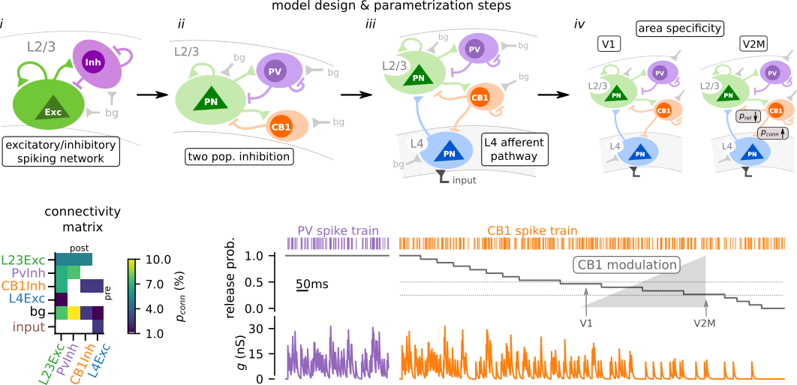
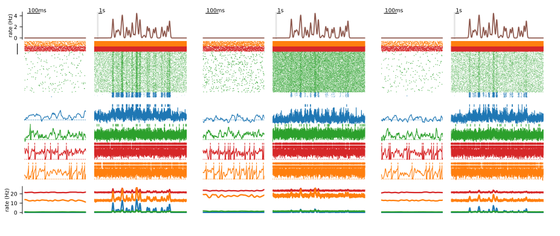

# Modeling cortical dynamics with CB1-mediated inhibition

> Simulation and analysis code for the modelling work of the study:
> "Visual area-specific tonic modulation of GABA release by endocannabinoids sets the activity and coordination of neocortical principal neurons"

## Requirements / Installation

Using `git`:
```
git clone https://github.com/yzerlaut/CB1_ntwk_modeling
cd CB1_ntwk_modeling
git submodule init
git submodule update
```
Note that the code relies on custom modules for [spiking network simulation](https://github.com/yzerlaut/neural_network_simulations) (based on Brian2) and [data visualization](https://github.com/yzerlaut/datavyz) (based on matplotlib).

## Model 

- randomly connected network (~sparsely connected)
- leaky integrate-and-fire neurons
- conductance-based synapses
- exponential waveform for synaptic events



#### Running the parametrization steps
```
# --- Layer23-circuit connectivity optimization --- #
python src/L23_connec_params.py scan
python src/L23_connec_params.py scan-analysis
# --- input strength optimization --- #
python src/input-processing.py seed-input-scan
python src/input-processing.py seed-input-analysis
```

## Results

- analyzing spontaneous activity levels in the different model settings (V1, V2M, V2M-CB1-KO)
- analyzing input-evoked dynamics in the different settings (correlations)



#### Getting the results
```
# --- look at gain curves --- #
python src/gain.py V1 with-repeat
python src/gain.py V2 with-repeat
python src/gain.py V2-CB1-KO with-repeat
python src/gain.py analysis
# --- final spontaneous activity --- #
python src/Model.py V1 &
python src/Model.py V2 &
python src/Model.py V2-CB1-KO 
python src/Model.py plot
# --- final temporal dynamics --- #
python src/input-processing.py V1 &
python src/input-processing.py V2 &
python src/input-processing.py V2-CB1-KO 
# sleep 10s
python src/input-processing.py plot
```

#### N.B. usage

The module uses "relative import" so everything should be launched from the root directory (`CB1_ntwk_modeling/`):
- notebooks: `jupyter notebook notebooks/notebook_of_interest.ipynb`
- scripts: `python src/the_script_of_interest.py --arguments bla bla`

