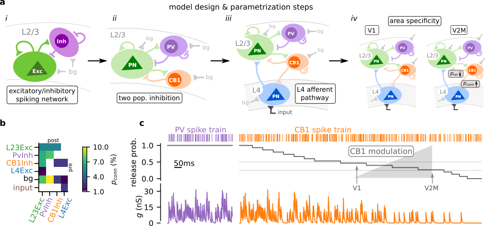
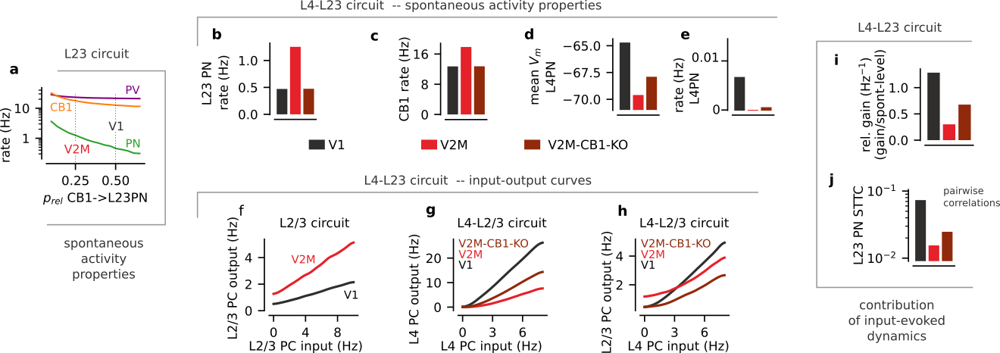

# Modeling cortical dynamics with CB1-mediated inhibition

> Simulation and analysis code for the modelling work of the study:
> "Visual area-specific tonic modulation of GABA release by endocannabinoids sets the activity and coordination of neocortical principal neurons"

## Requirements / Installation

Using `git`:
```
git clone https://github.com/yzerlaut/CB1_ntwk_modeling
cd CB1_ntwk_modeling
git submodule init
git submodule update
```
Note that the code relies on custom modules for [spiking network simulation](https://github.com/yzerlaut/neural_network_dynamics) (based on [Brian2](https://brian2.readthedocs.io/en/stable/)) and [data visualization](https://github.com/yzerlaut/datavyz) (based on matplotlib).

## Model 

- randomly connected network (~sparsely connected)
- leaky integrate-and-fire neurons
- conductance-based synapses
- exponential waveform for synaptic events


_**Modeling the impact of the visual-area-specific CB1 modulation properties on the dynamics of cortical circuit. (a)** Schematic of the steps for the design of the model design and its parametrization (see Methods). **(b)** Connectivity matrix of the model in the V1 settings (see also Table 1). **(c)** Illustration of the effect of release probability variations in the conversion of a Poisson process into synaptic conductance variations g. We show variations for the CB1 synapse and we highlight the two levels considered in the main text corresponding to the V2M and V1 settings. As in this illustration, the release probability for PV synapses is fixed to 1 in the whole study._

#### Running the parametrization steps
```
# --- Layer23-circuit connectivity optimization --- #
python src/L23_connec_params.py scan
python src/L23_connec_params.py scan-analysis
# --- input strength optimization --- #
python src/input-processing.py seed-input-scan
python src/input-processing.py seed-input-analysis
```

## Results

- analyzing spontaneous activity levels in the different model settings (V1, V2M, V2M-CB1-KO)
- analyzing input-evoked dynamics in the different settings (gain, correlations)


_**Single realization of the network simulations in the V1, V2M and V2M-CB1-KO settings (from left to right).** From top to bottom, we show the random waveform that sets the time-varying input, the spike raster activity (showing a subset of 500 neurons for L4Pn and all neurons for the PV+, CB1+ and L2/3PC populations), an example Vm traces for each of the population and the time-varying rates of the network populations. For each case, we show a zoom on a 500ms sample of activity (left subplots in each setting) and the full simulation. Spiking events were subsampled by 5 for display._



_**Effect summary**. CB1 modulation sets the level of ongoing activity and control the amount of input-evoked correlations in the L4-L23 circuit._


#### Getting the results
```
# --- look at gain curves --- #
python src/gain.py V1 with-repeat
python src/gain.py V2 with-repeat
python src/gain.py V2-CB1-KO with-repeat
python src/gain.py analysis
# --- final spontaneous activity --- #
python src/Model.py V1 &
python src/Model.py V2 &
python src/Model.py V2-CB1-KO 
python src/Model.py plot
# --- final temporal dynamics --- #
python src/input-processing.py V1 &
python src/input-processing.py V2 &
python src/input-processing.py V2-CB1-KO 
# sleep 10s
python src/input-processing.py plot
```

#### N.B. usage

The module uses "relative import" so everything should be launched from the root directory (`CB1_ntwk_modeling/`):
- notebooks: `jupyter notebook notebooks/notebook_of_interest.ipynb`
- scripts: `python src/the_script_of_interest.py --arguments bla bla`

